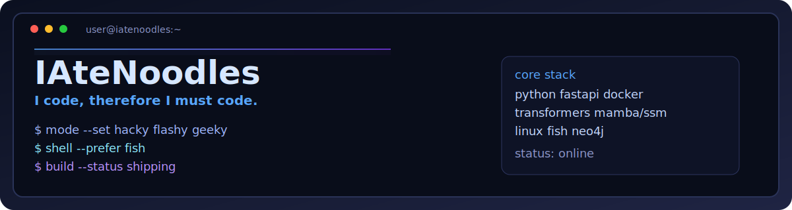

<p align="center">
  
</p>

<p align="center"><strong>AI/ML Researcher · Linux Tinkerer · Overengineer</strong></p>

<p align="center">
  <a href="https://github.com/IAteNoodles"></a>
  
</p>

<p align="center">
  
</p>

<p align="center">
  
  
  
  
</p>

```bash
role:: ai/ml-researcher | linux-tinkerer | overengineer
motto:: i-code-therefore-i-must-code
shell:: fish > bash
focus:: local-llm | transformers | mamba/ssm | context-window-reduction
style:: build-real-things -> add-unnecessary-complexity-for-fun
```

`projects::` [pharmaguard](https://github.com/IAteNoodles/Rift2k26) · [live](https://pharmaguard-tbo.netlify.app/) | [redshield](https://github.com/IAteNoodles/inceptrix2026) | [medgraph](https://github.com/IAteNoodles/MedGraph)

`stack::` `python` `fastapi` `transformers` `mamba/ssm` `docker` `linux` `fish` `neo4j` `groq`

## Runtime Stats

<p align="center">
  
  
</p>

<p align="center">
  
</p>

<p align="center">
  
</p>
